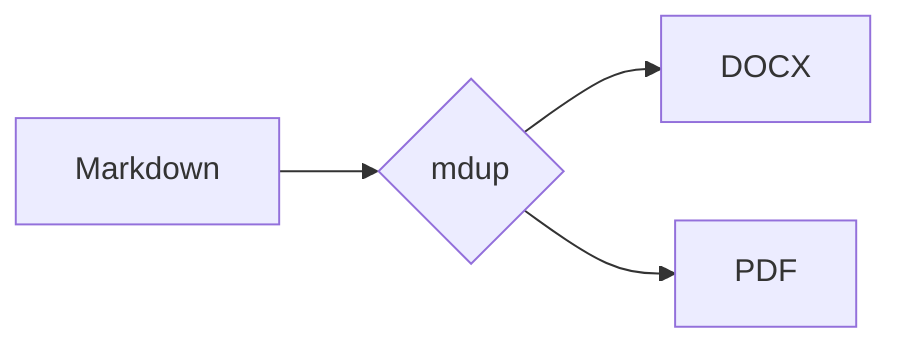

# mdup Feature Sample

[TOC]

This document exercises the Markdown features mdup supports. It has **bold**,
*italic*, ~~strikethrough~~, `inline code`, and a [link](https://example.com).

## Lists

- Unordered item
- Nested:
  - child one
  - child two

1. First
2. Second
3. Third

### Task list

- [x] Implement renderer
- [ ] Conquer the world

## Table

| Feature   | Supported | Notes                 |
| --------- | :-------: | --------------------- |
| Tables    |    ✅     | GFM pipe tables       |
| Footnotes |    ✅     | see below[^1]         |
| Math      |    ✅     | rendered if available |

## Admonitions

!!! note "Heads up"
    Admonitions render as colour-coded callout boxes in both PDF and DOCX.

!!! warning
    Without an explicit title the type name is used.

## Blockquote & code

> The best way to predict the future is to invent it.

```python
def greet(name: str) -> str:
    return f"Hello, {name}!"
```

## Image


## Math

Inline mass-energy equivalence: $E = mc^2$, and a displayed equation:

$$
\int_{0}^{\infty} e^{-x^2}\,dx = \frac{\sqrt{\pi}}{2}
$$

## Diagram



[^1]: This is a footnote, rendered at the end of the document.
